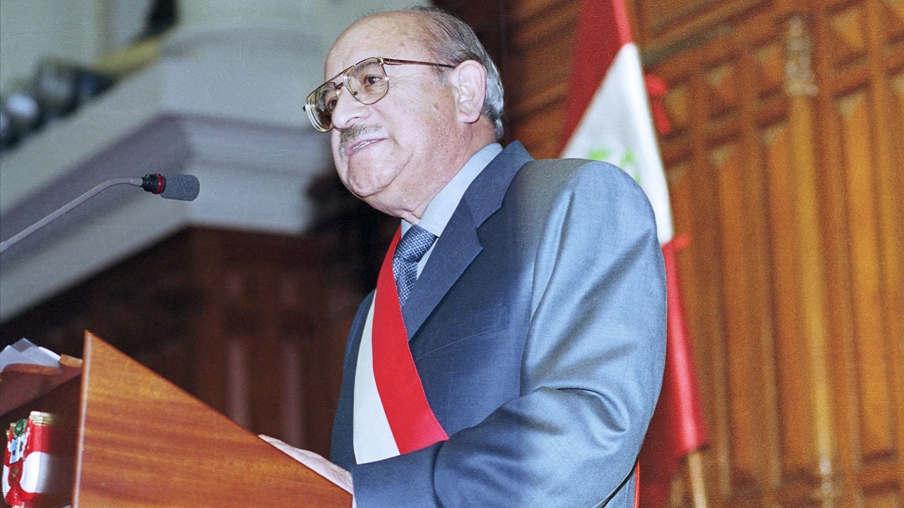

```{r setup, include=FALSE}
knitr::opts_chunk$set(echo = TRUE)
```

# Prólogo

> Vergara, Alberto (2018). Ciudadanos sin República: De la precariedad institucional al descalabro político (2.ª ed.). Editorial Planeta.

## Los Dos Proyectos de Estado en el Perú

Hay dos proyectos de Estado, dos ideales hacia los que cuales apuntar al intentar construir la nación peruana.

El primero es el proyecto neoliberal y el segundo lo que Vergara denomina *proyecto republicano*.

El proyecto neoliberal se basa en la promoción de una economía en la que se privilegia la mayor libertad posible para la iniciativa empresarial privada. Por implicancia, se entiende que el Estado debería tener el tamaño más reducido posible, y su intervención social restringirse a lo indispensable. Este orden de ideas da forma al sistema económico nacional desde el infame "paquetazo" del año 1990.

Lo que Vergara etiqueta como *proyecto republicano* consiste básicamente en asumir al ciudadano como agente político, respetar a las instituciones ---y al contrapeso entre ellas que permite mantenerlas en balance---, y tratar de mantener el *estado de derecho*, entendido como el acatamiento a lo que las distintas instituciones dispongan, así como al ordenamiento legal en general.

## Cómo se relacionan los dos Proyectos

Por desgracia, en el Perú se ha instaurado una dinámica en la que ambos "proyectos" se contraponen. Cualquiera puede ver que no hay ninguna necesidad lógica o práctica para que esto sea así. En términos teóricos, es fácil concebir un país de economía neoliberal donde al mismo tiempo campeen el imperio de la ley y las instituciones fuertes. En el terreno de la realidad, es fácil enumerar países donde esto se da (solemos llamarlos "países del primer mundo").

De modo que tenemos ante nosotros la tarea de investigar por qué en el país:

-   Se concibe ambas opciones como si fueran excluyentes entre sí;

-   Los defensores del neoliberalismo no contemplan la inclusión de una *agenda republicana* dentro de su acción política.

-   Ningún partido ni líder político ha logrado convertir la *agenda republicana* en una plataforma electoral viable.

### Alan, El Cínico


En el libro no se especifica esto, pero parece bastante claro que en la mente de muchos ciudadanos peruanos la preocupación por la democratización de la sociedad no parece ser una prioridad auténtica y sentida[^1]. Puede que, preguntados públicamente, una amplia mayoría declare que la democracia es importante. Hay mucho de deseabilidad social en eso: nadie quiere parecer autoritario (al menos, no todavía). Pero las acciones van por otro lado.

[^1]: De hecho, al menos el limeño típico solo parece ofenderse por la falta de respeto cuando se trata de defender *sus* derechos, mientras que contempla con laxa insensibilidad la imposición sobre *los otros.*

Desde la segunda elección de AGP se ha hecho muy claro que el total descuido de la institucionalidad democrática es *deliberado*. Los señeros artículos de García, donde usa famosamente la metáfora del "perro del hortelano" para describir el profundo desprecio que le merecía cada hectárea de terreno capitalizado, cada actividad no sujeta al imperio de la meritocracia, toda comunidad campesina con tierra que no aprovechaba ni rentabilizaba al máximo posible, en suma, toda esfera de actividad peruana donde la obsesión con el rendimiento económico no fuera la absoluta prioridad, hicieron que las élites peruanas se rindieran como adolescentes al encanto presidencial.

Para ser justos, al menos García tenía la capacidad intelectual para articular los ideales extractivistas y capitalistas de las élites de manera sociamente aceptable y retóricamente atractiva. Comparado con la parquedad de un PPK ---que parecía tener la habilidad oratoria de una hoja de cálculo Lotus 123---, las anécdotas rurales y gallináceas de Pedro Castillo[^2], y la total falta de altura de trato de Boluarte[^3], AGP reluce como una pulsera de vidrio barato en medio de un montón de piedra pómez.

[^2]: Las virtudes comunicativas de Castillo eran tan módicas que fue incapaz de siquiera contar el chiste zafio del niño que ahorca ---o no--- a un pollo en función de la respuesta de su interlocutor.

[^3]: Doña Dina enriqueció el anecdotario de la política peruana cuando, ante un enardecido ciudadano que le mentara la madre, replicara: *¡La tuya!*, a voz en cuello.

Ese romance entre los grandes grupos de poder y *su* presidente será materia de leyenda para los historiadores futuros. Proverbial bombero maduro de juventud incendiaria, el García obeso y conservador hubiera sido cubierto de ridículo por su alter ego juvenil, impregnado de la rebeldía del primer aprismo. Al tiempo que recibía el obsequioso homenaje de los Miró Quesada y era ovacionado en los *CADE*, increpaba al eventual periodista *faltoso* con apelaciones pseudomárquicas del tipo: *"¿Y usted para quién trabaja?"*, o ---ante las sospechas y acusaciones de inconducta--- con el insultante reto general de su célebre arrebato: "*¡Demuéstrenlo pues, imbéciles!*"[^4]

[^4]: Es muy probable que la causa eficiente de su suicidio haya sido la más burda vanidad, que le hacía insoportable la mera idea de verse en presidio, aunque fuera solo de forma episódica (como muy probablemente hubiera sido el caso, dada la ubicua presencia del aprismo y el filoaprismo en el Poder Judicial).

El neoliberalismo apasionado del billete es daltónico ante el colorido de la fauna política. En eso se parece a su primo bastardo, el viejo clientelismo peruano (que nunca ha muerto; que nunca morirá, mientras quede una concesión o un contrato estatal del que beneficiarse). Le da un mucho igual quién gobierne, ZdM, DBA o cualquier variedad intermedia, con tal de preservar el *business as usual*.

Persiste, entonces, el enigma. Si al neoliberalismo le da un poco igual qué viento político sople, ¿por qué la concepción excluyente?

### Paniagua, el Republicano



Como bien señala el autor, tanto el neoliberalismo despótico de Alan como el republicanismo de Paniagua son prescripciones, recetas de qué necesita el país, establecidas desde el ejercicio directo del poder. No es que sean creaciones originales; son versiones simplificadas de viejas concepciones de la Filosofía Política. El liberalismo político desciende en directo del neoliberalismo económico (no hablemos de Locke; conformémonos con Reagan y Thatcher, que ya es mucho decir); el republicanismo reclama una herencia desde el mismísimo Montesquieu y Madison.

Curioso que con tan ilustres ancestros el "republicanismo" ---yo preferiría denominarlo "institucionalismo" o la sencilla idea de que las reglas importan más que los jugadores, y que la ley no es justa si no es impersonal--- no haya tenido casi practicantes efectivos desde el poder peruano. Sin duda, el medio ambiente político nacional ha estado impregnado de un fuertísimo olor a exclusión y utilitarismo vertical. Relegada constantemente al desván de lo deseable y declarativo, a los discursos colegiales y a las monografías académicas, fue hasta cierto punto desconcertante que Valentín Paniagua desempolvara ese *set* de ideas en sus discursos de asunción presidencial (del Congreso y del Ejecutivo).

La clave para entender a la prioridad institucional es que el fin último es restaurar la relación entre el Estado y el ciudadano. Es una iniciativa de reconciliación.

Don Valentín fue excepcional en muchas dimensiones, no siendo la menor la coherencia entre las resoluciones establecidas en su discurso inaugural y las acciones realizadas a lo largo de sus brevísimos ocho meses de su gobierno. Los organismos electorales fueron redirigidos hacia políticas que tomaban más en cuenta al ciudadano; las FFAA fueron despolitizadas, y el MEC incluyó acciones concretas de transparencia en el gasto.

Ni falta hace decirlo: nadie ha tomado la posta, hasta hoy[^5]. Cuando se presentó a las elecciones, un lustro después, apenas si obtuvo poco más del 5% de los votos. Tal vez será pedagógico recordar que, en ese año (2006), fueron Alan García y Ollanta Humala quienes pasaron a la segunda vuelta electoral. Sí; un AGP que venía de haber sido, según el consenso histórico y las cifras de desempeño, el peor presidente de la Historia del Perú. Y un Humala en su periodo más autoritario y contestatario, el "Ollanta Polo Rojo", en ese instante probablemente el más amenazante para la democracia, que venía de apoyar la revuelta armada de su hermano Antauro en contra del Presidente Toledo.

[^5]: Escribo esto entre la primera y segunda vuelta de las elecciones presidenciales del 2026.

En otras palabras: el votante peruano prefirió al peor mandatario desde 1821, y a un militar autoritario con antecedentes de querer quebrar el estado de derecho, antes que al primer presidente que desde 1980 se había preocupado por restablecer la relación entre Estado y ciudadanía.

### Acotación: El Peruano y la Democracia, en Números {#democracia-peru-data}

En cuanto psicólogo social, no me basta con el *feeling*[^6] acerca de la poca estima de mis compatriotas en relación a la democracia. Hay que aterrizarlo. Y aunque hay diversas maneras de hacerlo —diversos periodos, varios estudios, múltiples metodologías—, y debido a que no es el tema central de este artículo, usaré una base de datos a la mano: la encuesta que Latinobarómetro realiza en muchos países del continente cada año. Aunque lo adecuado sería realizar una serie de tiempo, una vez más: debido a la complejidad y a que no es el foco de estas líneas, me limitaré a graficar los resultados disponibles más cercanos al momento en que escribo: la "oleada" del 2024.

[^6]: Es asombroso ver cuán poco se preocupan los científicos sociales, en sus interacciones con el gran público, en usar fuentes resultado de investigación. Es entendible que no se detallen bibliografías o referencias, pero en términos comunicacionales, es importante especificar que el origen de las afirmaciones de un analista social provienen de investigación y no de mera teoría, o —peor aún— del "pálpito".

He aquí algunos cuadros generados a partir de esa data[^7]:

[^7]: <https://www.latinobarometro.org/latinobarometro-2024>

|  |  |
|------------------------------------|------------------------------------|
| **Postura Política** | **Porcentaje (%)** |
| **La democracia es preferible a cualquier otra forma de gobierno** | 44.25% |
| **A la gente como uno, nos da lo mismo un régimen democrático que uno no democrático** | 29.67% |
| **En algunas circunstancias, un gobierno autoritario puede ser preferible a uno democrático** | 19.08% |
| **NS/NR (No sabe / No responde)** | 7.00% |
| **Total** | **100.00%** |

```{r graf, echo=FALSE}
# Si no tienes instalado ggplot2, descomenta y corre la siguiente línea:
# install.packages("ggplot2")

library(ggplot2)

# 1. Crear el data frame con los datos consolidados
datos <- data.frame(
  postura = c(
    "La democracia es preferible\na cualquier otra forma de gobierno",
    "A la gente como uno, nos da lo mismo\nun régimen democrático...",
    "En algunas circunstancias, un gobierno\nautoritario puede ser...",
    "NS/NR (No sabe / No responde)"
  ),
  porcentaje = c(44.25, 29.67, 19.08, 7.00)
)

# 2. Convertir la columna 'postura' en un factor y fijar los niveles en orden inverso.
# Esto es necesario para que ggplot2 dibuje la barra de mayor porcentaje en la parte superior.
datos$postura <- factor(datos$postura, levels = rev(datos$postura))

# 3. Definir la paleta de colores para cada postura
colores <- c(
  "La democracia es preferible\na cualquier otra forma de gobierno" = "#4C72B0",
  "A la gente como uno, nos da lo mismo\nun régimen democrático..." = "#DD8452",
  "En algunas circunstancias, un gobierno\nautoritario puede ser..." = "#C44E52",
  "NS/NR (No sabe / No responde)" = "#8C8C8C"
)

# 4. Construir el gráfico
grafico <- ggplot(datos, aes(x = porcentaje, y = postura, fill = postura)) +
  # Crear las barras horizontales
  geom_bar(stat = "identity", width = 0.7) +
  
  # Añadir las etiquetas de texto con el formato de porcentaje (2 decimales)
  geom_text(aes(label = sprintf("%.2f%%", porcentaje)), 
            hjust = -0.2, size = 4.5, fontface = "bold", color = "#333333") +
  
  # Aplicar los colores personalizados
  scale_fill_manual(values = colores) +
  
  # Expandir un poco el eje X para que los números no se corten al final
  scale_x_continuous(expand = expansion(mult = c(0, 0.15))) +
  
  # Textos y títulos
  labs(
    title = "Apoyo a la democracia en Perú\n(Latinobarómetro, 2024)",
    x = "Porcentaje (%)",
    y = NULL # Quitamos el título del eje Y porque las etiquetas se explican solas
  ) +
  
  # Tema visual limpio y minimalista
  theme_gray() +
  theme(
    legend.position = "none", # Escondemos la leyenda (es redundante)
    plot.title = element_text(size = 16, face = "bold", margin = margin(b = 15)),
    axis.text.y = element_text(size = 11, color = "black"),
    axis.text.x = element_text(size = 10),
    axis.title.x = element_text(size = 12, face = "bold", margin = margin(t = 10)),
    panel.grid.major.y = element_blank(), # Quitamos líneas horizontales de fondo
    panel.grid.minor = element_blank(),
    axis.line.x = element_line(color = "gray50") # Línea del eje X visible
  )

# 5. Mostrar el gráfico en la ventana de "Plots"
print(grafico)

# Opcional: Si deseas guardar el gráfico como una imagen de alta resolución, usa ggsave()
# ggsave("apoyo_democracia_peru.png", plot = grafico, width = 10, height = 6, dpi = 300)
```

Como Latinobarómetro hace la misma encuesta (poco más o menos) cada año en el mismo espacio geográfico, es posible establecer ciertas comparaciones. En especial, ¿cómo se compara ese ya lejano 2006[^8] con los datos disponibles más recientes?

[^8]: <https://www.latinobarometro.org/latinobarometro-2006>

| Postura Política | 2006 (%) | 2024 (%) |
|:-----------------------|:-----------------------|:-----------------------|
| **La democracia es preferible a cualquier otra forma de gobierno** | 55.00% | 44.25% |
| **A la gente como uno, nos da lo mismo un régimen democrático que uno no democrático** | 18.00% | 29.67% |
| **En algunas circunstancias, un gobierno autoritario puede ser preferible a uno democrático** | 19.00% | 19.08% |
| **NS/NR (No sabe / No responde)** | 8.00% | 7.00% |
| **Total** | **100.00%** | **100.00%** |

Esto nos indica que el poco favor hacia la democracia, si algo ha cambiado, ha sido para peor: al menos el año 2024, en el Perú la gente la rechazaba *aun más* que cuando eligieron a AGP y al "Ollanta Polo Rojo" por encima de Paniagua.

Claro está, el panorama es mucho más complejo y hay varios ítems más en esta encuesta —así como un análisis longitudinal— que podrían tomarse en cuenta. Pero como ya indicamos, esto no es más que una acotación a las notas de lectura del prólogo del libro, destinada tan solo a echar un vistazo a la situación actitudinal de los peruanos en torno a la idea de democracia.

Aun con todas esas limitaciones, el análisis de estos datos nos ayuda a formarnos una idea de por qué tantas personas muestran un gran nivel de tolerancia a las infracciones al estado de derecho por parte de, por ejemplo, el fujimorismo.
