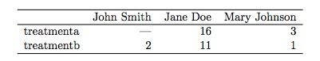
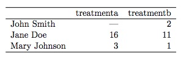
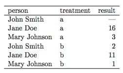
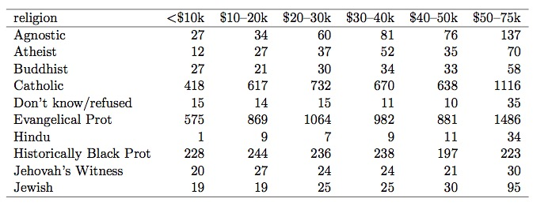
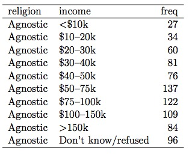
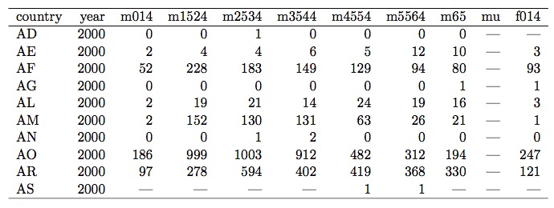
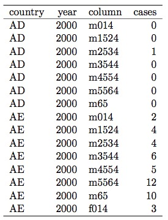
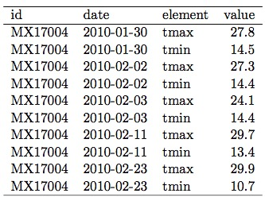
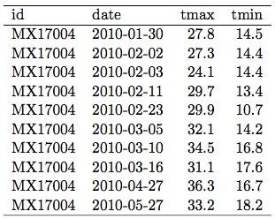

- [Comparte en Facebook](https://www.facebook.com/sharer/sharer.php?u=https%3A//www.martinvargas.org.pe/post/data_wrangling/)
- [Comparte en LinkedIn](https://www.linkedin.com/shareArticle?mini=true&url=https%3A//www.martinvargas.org.pe/post/data_wrangling/&title=Preparando%20tus%20Datos&summary=&source=)
- [Comparte en Twitter](https://twitter.com/intent/tweet?text=Les%20comparto%20un%20art%C3%ADculo%20interesante%3A%0Ahttps%3A//www.martinvargas.org.pe/post/data_wrangling/)
- [Comparte vía correo](mailto:?subject=Interesante%20Art%C3%ADculo&body=Comparto%20un%20art%C3%ADculo%20interesante%3A%20https%3A//www.martinvargas.org.pe/post/data_wrangling/)

## Introducción

Cuando hacemos una investigación o tesis cuantitativa, a menudo se hace necesario "vaciar" los datos en una hoja de cálculo, o incluso hacer tablas manuales, antes de poder analizarlos en un software estadístico para llegar a una interpretación y conclusiones.

En este artículo, te resumiré algunas pautas importantes para poder preparar tu data (usaremos el término *data* o *datos* indistintamente), tomadas del importante artículo de Hadley Wickham ***"Tidy Data"*** (Wickham, 2014).

## Tidy Data o "Data Ordenada"

*Tidy Data* es una frase inglesa que podría traducirse como "data ordenada", en el sentido de data arreglada, limpia, o correctamemnte dispuesta. Es una forma consistente y estandarizada de disponer la data para un procesamiento eficiente a fin de ingresarla a SPSS, R, Jamovi, SAS u otros software estadístico. Es el resultado final de un proceso que denominaremos "Preparación de la Data".

Se trata de un proceso continuo, que no se hace una sola vez y ya, debido a que es usual que para algunos análisis o para comprobar ciertas hipótesis, se tenga que "rearreglar" la data más de una vez. 

Recomendamos a quien esté particularmente interesado en el tema la lectura del artículo original, cuya refrencia anotaremos al final de este artículo. Es uno de los textos clave sobre el asunto.

> Mantener el estándar *Tidy Data* permite analizar más rápido, sin tener que "acomodar" la data primero, así como también hace posible colaborar fácilmente con otros. Por último, también nos permitirá hacer interface con otros sistemas y herramientas de software sin necesidad de hacer muchas modificaciones. 

## Variables, Observaciones y Valores

Todo conjunto de datos (también llamado *data set*) tiene tres elementos:  

1. **Variables**: consiste en la medición de algún tipo de atributo propio de la unidad de análisis. Ejemplos: duración, frecuencia, cantidad, altura, etc.   
2. **Observaciones**: Es la recolección de una variable en un momento específico del tiempo, medida en una única entidad o unidad de análisis. Ejemplos: el tiempo que le toma a un alumno completar el examen de fin de semestre en un día determinado.   
3. **Valores**: Son la intersección entre variables y observaciones.

Para hacer tu data "ordenada" se debe seguir tres simples convenciones:

>* Cada variable debe formar una columna (es decir, en vertical). Ergo, el nombre de cada columna debe ser el nombre de una variable.  
* Cada fila  (en horizontal) debe contener una única observación.   
* Cada tabla debe contener data acerca de una única unidad observacional.    

Algunos ejemplos, tomados de Wickham, de lo que se debe y no se debe hacer en términos de tablas:  

En la tabla de arriba el problema consiste en que se ha dispuesto a las unidades de análisis (las personas) en las columnas, mientras que las variables (tipos de tratamiento) están en las filas.

En el segundo ejemplo (debajo), la disposición está un poco mejor pero aún puede mejorarse. Al menos ya se han dispuesto las variables en las columnas y las personas en las filas.   

     
    

El tercer ejemplo (justo debajo de estas líneas) nos muestra la misma data en la versión *arreglada*, en términos de Tidy Data. La idea es que cada tratamiento, aplicada a cada persona, aparezca en una fila.    

   
     

   
   
Según las convenciones de *Tidy Data*, en el último ejemplo se cuentan tres variables: *Persona*, *Tipo de Tratamiento* y *Resultado.* Además tenemos 06 *observaciones*, correspondientes a cada combinación de persona/paciente y tipo de tratamiento. Es importante notar que, por ejemplo, hay dos filas para Jane Doe, correspondientes a cada uno de los tratamientos que recibió, así como a los resultados correspondientes. Asimismo, John tiene un registro en "-". Esto no quiere decir que no haya recibido ese tratamiento (si no lo hubiera recibido sencillamente no existiría esa fila); significa más bien que, pese a haber recibido ese tratamiento, no fue posible determinar el resultado. Por último, tenemos 18 *valores* para esta tabla: son los contenidos que están ubicados en las intersecciones de las variables con las unidades de análisis (en este caso, pacientes). Así pues, cada observación consiste en tres valores, correspondientes a cada una de las tres variables involucradas.

Este último ejemplo está formateado como Tidy Data porque:   
* Cada variable forma una columna  
* Cada observación forma una fila  
* Cada tipo de *unidad observacional* forma una tabla. En este caso, la unidad observacional es el paciente. Si tuviéramos datos acerca de los doctores y los tratamientos que aplican, tendríamos que registrarlos en una tabla distinta. *Unidad observacional* es otro nombre para lo que antes hemos llamado *unidad de análisis.*     

> Esta es una convención TY importante: Cada Tabla debe corresponder a una *única unidad observacional.*

## Tipos de Problema que afectan a la Data

Wickham, en su paper, identifica cinco categorías de problema que afectan a los data sets y los hacen *untidy* o "desarreglados":  

1. Columnas definidas por valores en vez de por variables  
2. Más de una variable registrada en la misma columna  
3. Variables registradas en filas ***y*** en columnas a la vez  
4. Dos o más unidades observacionales registradas en la misma tabla  
5. Una única unidad observacional registrada en múltiples tablas    

En la tabla siguiente tenemos un ejemplo del problema Tipo 1: las columnas están definidas por valores en vez de variables. Estos datos provienen de un estudio realizado por el Pew Research Center acerca de religión y niveles de ingreso económico familiar en EEUU.

La siguiente es una forma de arreglar el problema, haciendo que la data sea “Tidy” (ordenada) (Ojo, solo se muestran las primera filas, ya que al ordenarse la tabla se hace mucho más larga):    

  

La tabla a continuación muestra un ejemplo del problema Tipo 2: más de una variable registrada en una sola columna. 

   

En la siguiente tabla se ha dado un paso intermedio para ordenar la data: obsérvese, sin embargo,  la columna llamada "Column": contiene dos variables en simultáneo: género y edad.   

   

En la tabla siguiente vemos que se soluciona finalmente la inconsistencia y ya tenemos la data “tidy” u “ordenada”: hemos separado la variable género de la variable edad en columnas distintas.    

   

    
En la tabla siguiente vemos datos provenientes del reporte de una estación meteorológica ubicada en México. El problema en este caso es que existe una columna definida para cada día posible del mes (columnas de los días 09 a 31 omitidas). Obsérvese que para el mismo día y el mismo país se registra dos valores: temperatura máxima y mínima. Por lo tanto, la variable fecha está repartida en filas y columnas, y la variable temperatura en dos filas.   

       
    

En la tabla siguiente vemos que se realizó un paso intermedio: ya se estableció una columna para la variable fecha.       
    
        

La siguiente tabla ilustra el paso final en el reordenamiento: ahora ya hay una columna para cada fecha y para tipo de temperatura. Esta data ya está "arreglada" (*tidy*).

        

    
Para poder entender bien los dos últimos tipos de error hay que tener claro que *"Unidad Observacional"* es un concepto relativo, no absoluto. Por ejemplo, si mi objeto de estudio es una empresa bancaria, entonces registrar los datos de número de clientes y ventas mensuales de todas sus sucursales en una sola tabla cumpliría con los criterios de data "arreglada". Si, por el contrario, estuviera escribiendo una tesis consistente en un estudio  de clientes y ventas de una sucursal bancaria específica, entonces incluir en una tabla data de otras sucursales o bien data de indicadores económicos nacionales, estaría "desarreglando" la data, añadiendo información potencialmente innecesaria desde el punto de vista de procesamiento.   

Teniendo clara esta consideración, los últimos dos tipos de error son más fáciles de entender y detectar. Por ejemplo, la tabla de datos de varias sucursales del banco "X" dentro de una tesis centrada solo en una sucursal estaría "desarreglada" (problema tipo 4); mientras que vaciar los datos de cada sucursal del banco "X" en una tabla diferente generaría "desarreglo" si mi tesis trata se enfoca en ese banco como organización (problema tipo 5).
    
Por último, es importante tomar en cuenta que muchas veces lo que estamos llamando "data desarreglada" (*"untidy"*) lo es para efectos de procesamiento de data, en especial para efectos de procesamiento de data por programas de software como R y similares. No significa que necesariamente las tablas que hemos puesto como *untidy* sean versiones "incorrectas"; en muchas ocasiones los autores e instituciones disponen la data de esa forma porque se trata de presentaciones que para el ojo humano son más intuitivas y fáciles de leer. 

- [Comparte en Facebook](https://www.facebook.com/sharer/sharer.php?u=https%3A//www.martinvargas.org.pe/post/data_wrangling/)
- [Comparte en LinkedIn](https://www.linkedin.com/shareArticle?mini=true&url=https%3A//www.martinvargas.org.pe/post/data_wrangling/&title=Preparando%20tus%20Datos&summary=&source=)
- [Comparte en Twitter](https://twitter.com/intent/tweet?text=Les%20comparto%20un%20art%C3%ADculo%20interesante%3A%0Ahttps%3A//www.martinvargas.org.pe/post/data_wrangling/)
- [Comparte vía correo](mailto:?subject=Interesante%20Art%C3%ADculo&body=Comparto%20un%20art%C3%ADculo%20interesante%3A%20https%3A//www.martinvargas.org.pe/post/data_wrangling/)